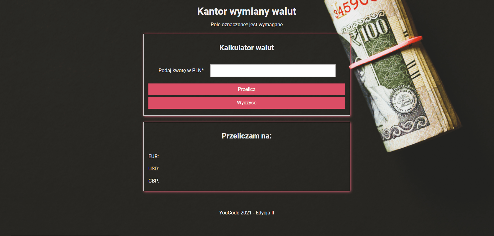

# Kasia Napierała - Currency converter

## Demo

https://klarma.github.io/currency-converter/

## Description

The currency calculator is another project that aims to show my basic knowledge in HTML, CSS, JS. It contains *BEM, ES6+ features: const, let, bloki*. I don't use more advanced solutions but instead ** I pay attention to details when writing the code and the ability to work in accordance with good practices **. The correctness of my work is supervised by [Krzysztof Dąbrowski](https://www.linkedin.com/in/dabrowskisoftware) - an experienced Senior Software Engineer.

## Instruction 

Enter the amount you want to convert from PLN to other currencies. Click the "Przelicz" button and you will get results in 3 popular foreign currencies at the bottom of the application. If you want to clear all fields, just hit on the "Wyczyść" button.